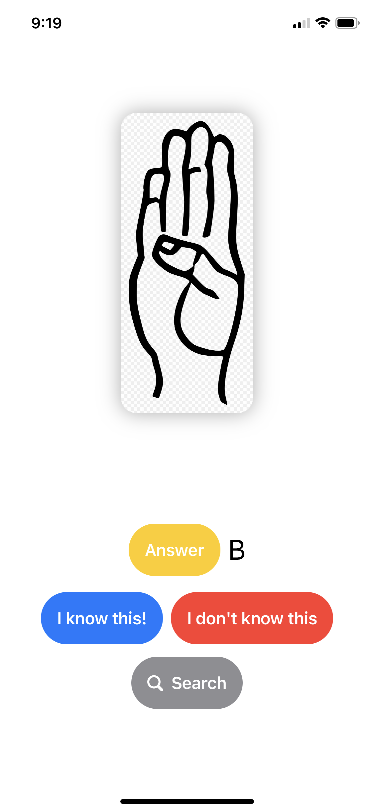
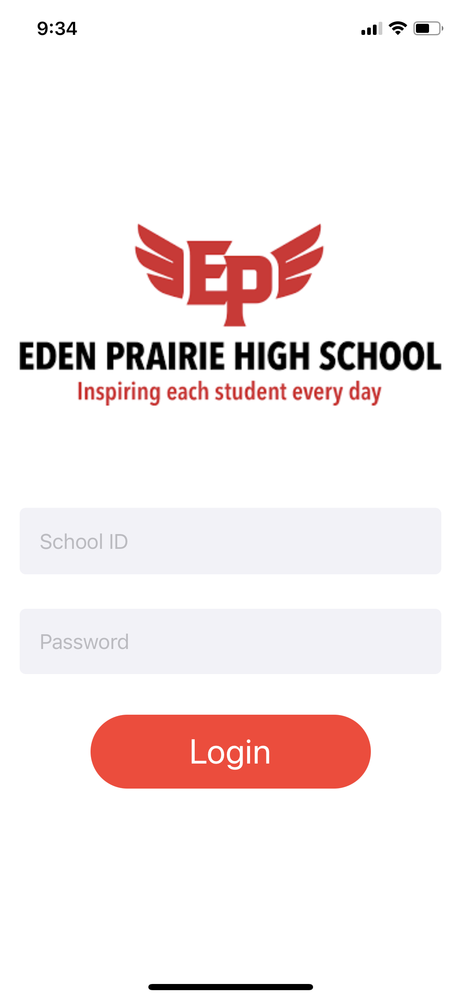
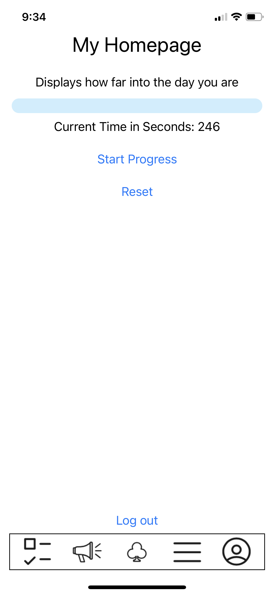
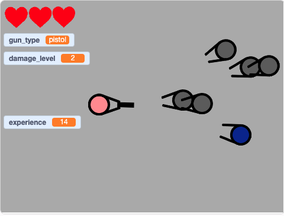

# iOS-Portfolio: Rachel Park
Rachel Park 2020-2021 Portfolio

Hello, I am Rachel Park, a junior at Eden Prairie High School, who wants to be a visionary engineer with the potential to change even small parts of people's lives. I have always been interested in technology and machines ever since I can remember. I consider myself a decent problem solver. That is why I wanted to learn how to code and have loved the learning process. Every programmer, I assume, knows the feeling when you resolve a problematic issue in your code, app, or website either in a complex manner or in a simpler, more efficient manner. I am usually in the former group; however, I have never deemed it as a weakness. It is my strength because it means that I approach problems from a different perspective and I am creative in my own way.

# Programming Experience
- HTML (2016 -)
- Python (2017 -)
- Scratch (2017 -)
- MIT App Inventor (2018 -)
- Java (2019 -)
- Swift (2020 -)

# [Jumanjee 5 (Java)](https://github.com/EPHS-Java-2020/final-post-ap-project-2020-javavavava.git)

This was my first group programming project where I gained so much insight into how crucial it is for team members to cooperate in order to build a successful program. As our project progressed, we faced a major challenge: we had to integrate our individual codes into one extensive program. We made numerous attempts to find the right path; if one way came to a dead end, we sought another. After days of discussing and searching, we had eventually figured out how to merge several files into one. At first, we knew we made a huge detour around an unknown, more direct solution. Yet, that detour became an incentive to discovering a more straightforward solution.

This game is a story-driven game that includes multiple levels, each having different kinds of games. For instance, the first level is the Memory game where a user needs to prove that he/she is intelligent enough to pass the first level, proceed to the next stage, and get close to obtaining the prize at the end of the game.

# [ASL Alphabets (iOS-Swift)](https://github.com/rachelPark1/asl-alphabets.git)

At the very beginning of this term, I wanted to make an app that was unique and helpful to minorities and could resolve even a small problem they were facing. I was having trouble with memorizing the American Sign Language alphabets, so I decided to build an app that works as effective ASL alphabet flashcards that implement spaced repetition, a powerful studying technique.

I learned how to link a website with a button, Swift fundamental syntax, and other basic operating systems including app icons, images, storyboards, and various sources Xcode offers. I had an idea that provides users with more diverse studying options, such as simple flashcards, tests, and matching games. To do that, I realized that it would require multiple interchangeable views for a smooth user experience. That particular skill I acquired while learning about multiple view controllers came in extremely useful when understanding the code my team and I have constructed for the EPHS App.

# [EPHS App (iOS-Swift)](https://github.com/connorholm/ephsapp2020.git)

I wanted to make a useful app that would improve EPHS students' everyday lives, rather than a game. Then, I recalled my first day of high school being overwhelmed by a maze of school hallways. I remembered having to click so many links in order to communicate with teachers and counselors. So, as a group, we decided to create an app that is the ultimate EPHS guide, involving a virtual school map, daily schedules, club announcements, direct contact with teachers and counselors, and other diverse features. We have built a login view for security reasons so that only EPHS students are permitted to access the school map. We have several views that switch when a user clicks a button.

# [Star Wars (Scratch)](https://scratch.mit.edu/projects/190889727)

This is the game that I made using Scratch.

Press SPACE bar to shoot. Move the cursor to change the direction the character is facing. Press A, S, D, and W to move around. Press 1 and 2 to change your weapon.

# [Ping Pong (MIT App Inventor)](https://github.com/rachelPark1/ping-pong.git)

This is a two-player ping pong game I built using MIT App Inventor.

# [Website: Dog (HTML)](https://codepen.io/pen/?template=XaoZMz)

This is a website about dogs I created using HTML.

# [Website: South Dakota (HTML)](https://codepen.io/pen/?template=qPRozr)

This is a website about South Dakota I created using HTML.

# [Python](https://github.com/rachelPark1/python-files.git)

These are all the coding that I did when learning Python.

